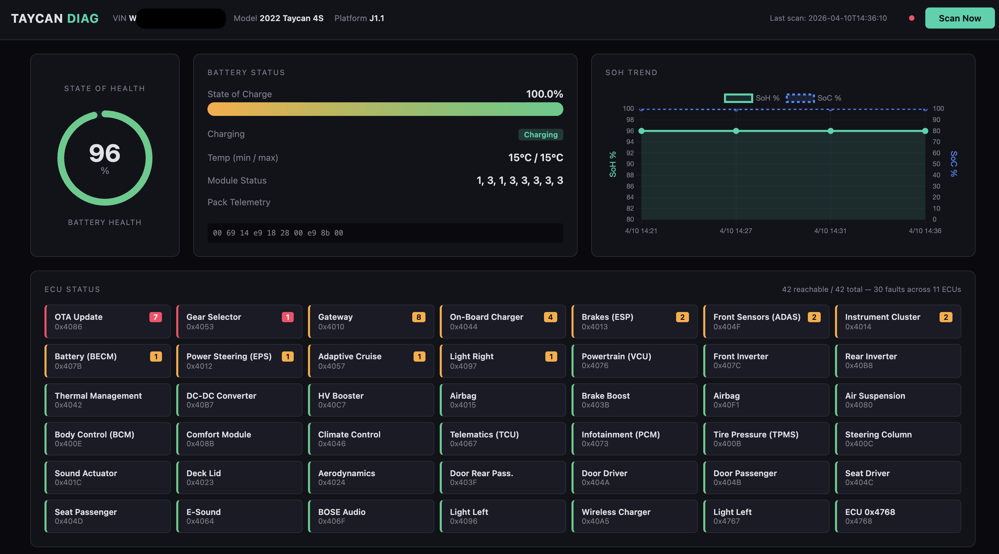

# Taycan Diagnostic Dashboard

Open-source diagnostic tool for the Porsche Taycan (J1 / J1.1 platform). Connects via the OBD-II port over Ethernet, reads battery health, fault codes, and ECU data from all 42+ modules, and displays everything in a live browser dashboard.



## What it does

- **Battery health monitoring** — reads State of Health (SoH), State of Charge (SoC), temperatures, module status, and charging state directly from the BECM
- **Full ECU scan** — probes all 42 ECUs for identification (part numbers, software versions, serial numbers) and fault codes (DTCs)
- **DTC filtering** — separates real faults from the thousands of "test not completed" entries that VAG ECUs return
- **Scan history** — every scan is auto-saved to JSON with SoH/SoC trend tracking over time
- **Live dashboard** — dark-themed browser UI with gauges, ECU grid (color-coded by fault status), and trend charts

## Hardware required

### ENET OBD-II cable

You need an Ethernet-to-OBD-II cable (ENET cable). This is the same type used for BMW/VAG diagnostics — a standard Ethernet cable with an OBD-II connector on one end.

[ENET OBD-II Cable (Amazon UK)](https://www.amazon.co.uk/dp/B0DYJKMGY3)

Any generic "BMW ENET cable" or "ENET to OBD2" cable will work. The cable connects:
- **OBD-II end** → diagnostic port under the Taycan's dashboard (driver side)
- **RJ45 end** → USB Ethernet adapter on your Mac (or direct Ethernet port)

### USB Ethernet adapter

If your Mac doesn't have an Ethernet port, you'll need a USB-C to Ethernet adapter. Any USB 10/100/1000 adapter works.

## Setup

### 1. Clone the repo

```bash
git clone https://github.com/kevinbird61/taycan.git
cd taycan
```

### 2. Create virtual environment and install dependencies

```bash
python3 -m venv .venv
source .venv/bin/activate
pip install -r requirements.txt
pip install flask
```

### 3. Configure your network interface

Connect the ENET cable to the OBD-II port and your Mac's Ethernet adapter. Then assign a link-local IP:

```bash
# Find your Ethernet adapter name
networksetup -listallhardwareports

# Configure it (replace en7 with your adapter)
sudo ifconfig en7 inet 169.254.10.1 netmask 255.255.0.0 up
```

### 4. Turn on the car

The ignition must be **ON** (foot on brake + start button), not just accessory mode. The gateway won't respond otherwise.

### 5. Discover the gateway

```bash
source .venv/bin/activate
python3 taycan_discover.py
```

This sends a UDP broadcast to find the DoIP gateway. You'll get the gateway IP and VIN. Update `taycan-dashboard/config.py` with the discovered gateway IP.

### 6. Find all ECU addresses

```bash
python3 taycan_find_ecus.py --quick
```

This opens a single TCP connection and probes ~8000 addresses in ~30 seconds. It saves the results to `discovered_ecus.json`, which the dashboard uses as its ECU registry.

### 7. Launch the dashboard

```bash
cd taycan-dashboard
source ../.venv/bin/activate
python3 app.py --host 0.0.0.0 --port 8080
```

Open http://localhost:8080 in your browser. Click **Scan Now** to pull live data from the car.

To access from another device on the same network, use your Mac's IP instead of localhost.

## CLI tools

The repo also includes standalone CLI tools:

| Tool | Description |
|------|-------------|
| `taycan_discover.py` | UDP broadcast to find the DoIP gateway |
| `taycan_find_ecus.py` | Fast ECU address discovery via single TCP connection |
| `taycan_enumerate.py` | Brute-force DID enumeration on a specific ECU |
| `taycan_scan.py` | Scan all ECUs for identification and DTCs |
| `taycan_battery.py` | Read battery-specific DIDs from the BECM |
| `taycan_read.py` | Read specific DIDs from any ECU |

## Protocol details

The tool communicates using standard automotive protocols:

- **DoIP** (ISO 13400) — Diagnostics over IP, wraps UDS messages in TCP
- **UDS** (ISO 14229) — Unified Diagnostic Services for reading data and faults
- Raw TCP sockets are used throughout (the `doipclient` Python library hangs on Taycan gateways)

### Taycan J1.1 specifics

- Gateway logical address: `0x4010` (not the typical `0x1010`)
- All ECU addresses are in the `0x40xx` range
- The BECM (battery controller) is at DoIP address `0x407B`
- SoC is at DID `0x0286` with scale factor `x0.75`
- SoH is at DID `0x028C` as a direct percentage

## Confirmed ECU addresses (Taycan J1.1)

| DoIP | Module | VAG Code |
|------|--------|----------|
| 0x4010 | Gateway | 0x19 |
| 0x407B | Battery (BECM) | 0x8C |
| 0x407C | Front Inverter | 0x51 |
| 0x40B8 | Rear Inverter | 0xCE |
| 0x4076 | Powertrain (VCU) | 0x01 |
| 0x4044 | On-Board Charger | 0xC6 |
| 0x40B7 | DC-DC Converter | 0x81 |
| 0x40C7 | HV Booster | 0xFF |
| 0x4013 | Brakes (ESP) | 0x03 |
| 0x4012 | Power Steering | 0x44 |
| 0x4080 | Air Suspension | 0x74 |
| 0x4015 | Airbag | 0x15 |
| 0x4073 | Infotainment (PCM) | 0x5F |
| 0x4014 | Instrument Cluster | 0x17 |
| 0x4057 | Adaptive Cruise | 0x13 |

Full list of 42 ECUs is discovered by `taycan_find_ecus.py`.

## File structure

```
taycan/
├── taycan_discover.py          # Gateway discovery (UDP)
├── taycan_find_ecus.py         # ECU address scanner
├── taycan_enumerate.py         # DID enumerator
├── taycan_scan.py              # Full ECU scanner
├── taycan_battery.py           # Battery data reader
├── taycan_read.py              # Generic DID reader
├── config.py                   # ECU map, DID definitions
├── doip_helpers.py             # DoIP/UDS library helpers
├── requirements.txt            # Python dependencies
│
└── taycan-dashboard/           # Web dashboard
    ├── app.py                  # Flask backend
    ├── doip.py                 # Raw DoIP/UDS protocol
    ├── config.py               # Dashboard configuration
    ├── scanner.py              # Scan orchestration
    ├── templates/
    │   └── dashboard.html      # Dashboard UI
    ├── static/
    │   └── dashboard.js        # Frontend logic + charts
    └── scans/                  # Auto-saved scan JSON files
```

## Safety

This tool uses **read-only** diagnostic operations (ReadDataByIdentifier, ReadDTCInformation, TesterPresent). It does not write to ECUs, clear fault codes, flash firmware, or modify any vehicle configuration. Standard UDS session only — no security access or programming sessions.

## Compatibility

Tested on:
- Porsche Taycan J1.1 (pre-facelift, MY2022)
- macOS with USB Ethernet adapter
- Python 3.11+

Should work on any J1 / J1.1 Taycan (2020-2024 pre-facelift). The J1.2 facelift (2025+) may have different ECU addresses — run `taycan_find_ecus.py` to discover them.

## License

MIT
